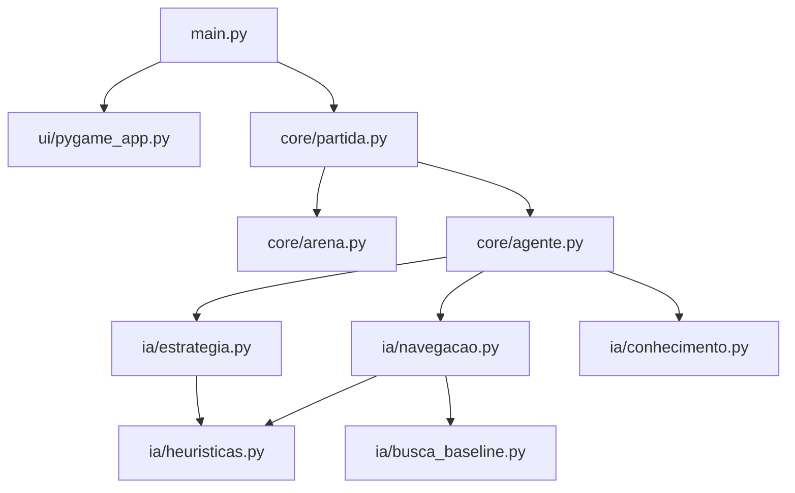
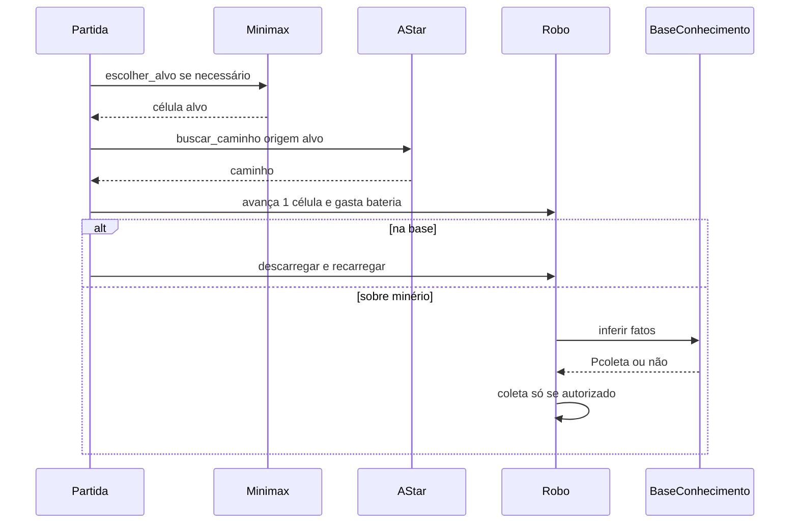

# Arquitetura do Arena Bot

Visão geral de como o código se organiza e como as técnicas de IA se conectam em tempo de execução.

## Diagrama de módulos

## Ciclo de um turno (obrigatório no PP01)

1. **Decisão estratégica (Minimax + α-β)** — [`ia/estrategia.py`](../ia/estrategia.py)  
   Escolhe o próximo minério (ou retorno à base). Profundidade padrão `d = 4`.

2. **Navegação (A* + Manhattan)** — [`ia/navegacao.py`](../ia/navegacao.py)  
   Calcula o caminho. Se inalcançável, o alvo vai para `alvos_descartados` e a decisão é refeita.

3. **Atuação** — um passo por turno; custo de bateria normal ou de armadilha ([`core/agente.py`](../core/agente.py)).

4. **Validação lógica (BC)** — [`ia/conhecimento.py`](../ia/conhecimento.py)  
   Nenhuma coleta sem passar por `inferir`. Regras mínimas do enunciado + duas autorais.

## Responsabilidades por pasta

| Pasta | Papel |
|-------|--------|
| `core/` | Mundo (arena), estado do agente, motor da partida, config editável |
| `ia/` | Heurísticas, A*, BFS baseline, Minimax, BC |
| `ui/` | Menu, opções, HUD, controles de janela (Pygame) |
| `config.py` | Constantes padrão do enunciado |
| `docs/` | Documentação para humanos (este material) |

## Base de conhecimento (resumo)

Símbolos e regras estão em `ia/conhecimento.py`. Coleta só ocorre se `Pcoleta` for derivado. Retorno à base pode ser forçado por `Pdescarga` (carga cheia ou bateria crítica).

## Configuração de partida

[`core/config_partida.py`](../core/config_partida.py) guarda valores que a tela **Opções** altera (rounds, paredes, armadilhas, dano de bateria). Sem abrir Opções, valem os defaults do enunciado.
